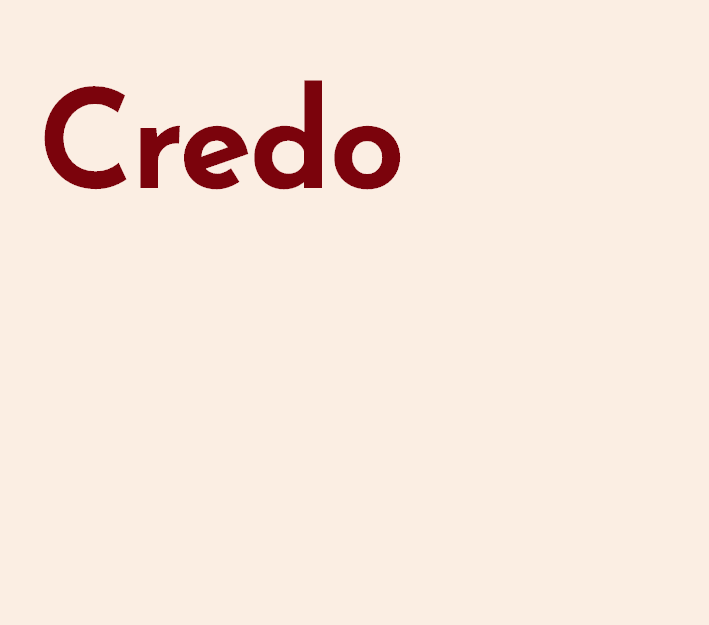

# AMA Site from Developers
> updated: 2020-05-01 19:52:10
> Developers (or former developers) of Seele Mainnet and Subnet.

## Us

We were paid and unpaid vulunteers of the open source dream once known as Seele. We were the ones who conquered the challenges in sharding protocol, created and implemented the STEM subchain protocol, launched and maintained mainnet for a year, invented MPOW the anti-asic algorithm, used one man teams to develop SeeleWallet, SeeleScan, and many SDKs. Talk is cheap, look at the code.

## Expect

- AMA questions will be continued to be collected through [Telegram Developer Group](https://t.me/credoDevTeam) with `#amadev` hashtag, answers will be posted AT LEAST weekly Friday 23:59:59 PT, starting on May 1st.
- Details of video AMA with Dr. Zheng Maolin and Dev Team to be announced.
- Details of voting icons and trademarks to be announced.

## Resources

- [Telegram Developer Group](https://t.me/credoDevTeam)
- [Telegram Developer Channel](https://t.me/credoDevAnnounce)
- [seele.pro](https://seele.pro/)
- [github seeleteam](https://github.com/seeleteam/)
- [seelescan](https://seelescan.net) (repairing)

## Disclaimers

- ~~https://seelen.pro/~~
- ~~https://t.me/seelenseelen2020~~
- ~~https://medium.com/@seelen~~
- ~~https://seeleview.net/#/~~
- ~~https://weibo.com/6561132287/profile?topnav=1&wvr=6~~
- ~~https://medium.com/@SeeleTech~~
- ~~https://twitter.com/SeeleTech~~
- ~~https://www.weibo.com/u/6561132287~~

## Support

TBD
